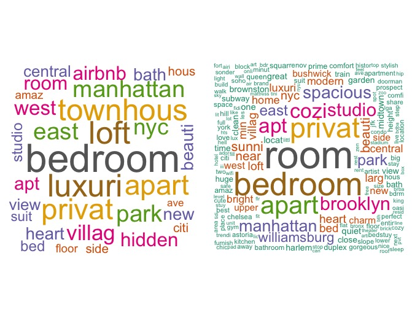

```{r setup, include=FALSE}
knitr::opts_chunk$set(echo = FALSE, fig.height = 5)
library(corrplot)
library(naniar)
library(ggplot2)
library(dplyr)
library(tibble)
library(tidyr)
library(purrr)
library(lme4)
library(jpeg)
library(ggpubr)
library(grid)
library(stringr)
library("ggmap")
library(ggmosaic)
library(MASS)
```

```{r pre, include=FALSE}
data = read.csv('AB_NYC_2019.csv', na.strings = c("", "NA"))
dat=data%>%filter(price!=0)
dat$reviews_per_month[dat$number_of_reviews==0]=0
```

## Introduction

- Data: 2019 Airbnb listings in NYC, 48895 observations.
- Goal: 
  - Patterns for price/popularity: influential factors? quantify influence?
  - Find the most valuable neighborhoods based on price/popularity balance
  - Post a listing: choice of location and name
- Model: 
  - CARBayes for `log(price)` and `log(1+reviews_per_month)` respectively.
  - LDA for text analysis

## EDA: Location matters for price

```{r pricemap, cache=TRUE,echo=FALSE, message=FALSE, warning=FALSE}
jet.colors <- colorRampPalette(c("#00007F", "blue", "#007FFF", "cyan", "#7FFF7F", "yellow", "#FF7F00", "red", "#7F0000"))
ny.map=get_map(location = c(left=-74.2445,right=-73.71298, bottom= 40.49975,top=40.9131),color = "bw",maptype = "toner",source = "stamen")
ggmap(ny.map)+
  geom_point(data = dat,
                 aes(x = longitude, y = latitude, color=log(price)),cex = 0.1,alpha=0.3) + 
  ggtitle("Distribution of log(price)") +
  scale_colour_gradientn(colors = jet.colors(7), limits = c(3,7))
```

## EDA: Location matters for popularity

```{r popmap, cache=TRUE,echo=FALSE, message=FALSE, warning=FALSE}
ggmap(ny.map)+
  geom_point(data = dat,
                 aes(x = longitude, y = latitude, color=log(1+reviews_per_month)),cex = 0.1,alpha=0.3) + 
  ggtitle("Distribution of log(1+reviews/mon)") +
  scale_colour_gradientn(colors = jet.colors(7), limits = c(0,3))
```

## EDA: Location matters for traffic

```{r trafficmap, cache=TRUE,echo=FALSE, message=FALSE, warning=FALSE}
ggmap(ny.map)+
  stat_density2d(data = dat,
                 aes(x = longitude, y = latitude,fill = ..level.., alpha = ..level..), 
                 geom = "polygon") + 
  scale_fill_gradient(low = "green", high = "red") + 
  ggtitle("2D-Density estimation")
```

## EDA: Potential effects

- Neighborhoods/boroughs: spatial effect exist
- Room type
  - Room type matters for price but not for popularity
  - Heterogeneity of room type exists across boroughs/neighborhoods 
    - Pearson's Chi-squared test (stat:6363.5,df:440,p-value:<2.2e-16)
- Minimum Night
  - nonlinear effect on price/popularity
```{r roomtype4, cache=TRUE,echo=FALSE, message=FALSE, warning=FALSE}
dat %>%
  filter(neighbourhood_group=="Manhattan")%>%
  group_by(neighbourhood,room_type) %>%
  summarise(n = n()) %>%
  mutate(freq = n / sum(n))%>%ungroup()%>%
  mutate(neighbourhood=as.numeric(neighbourhood))%>%
  ggplot(data=.)+
  geom_area(aes(x=neighbourhood,y=freq,fill=room_type),stat="identity",position = "stack")+
  theme_bw()+
  ggtitle("Heterogeneity of Room Type Across Neighborhoods (Manhattan)")
```

```{r testroom, eval=FALSE, message=FALSE, warning=FALSE, cache=TRUE, include=FALSE}
tbl=table(dat$room_type,dat$neighbourhood)
chisq.test(tbl)
```

## Data Preprocessing

- Delete: `id`, `host_name` and `last_review`; 11 listings with price 0.
- Impute: impute 0's for `reviews_per_month` (10052 records).
- Categorize: `minimum_nights` to 5 groups by weeks.
- Transformation: `log(price)`, `log(1+reviews_per_month)`. 
- Incorporate new dataset: 
  - shape file for neighbourhoods (NYC Opendata)
  - locations for metro stations
- Text cleaning:
  - Remove punctuations, stopwords, etc.
  - Word nomalization (Porter's stemmer algorithm)

## Model: CARBayes

\begin{itemize}
  \item Interested in neighbourhood-based patterns
	\item Multilevel Conditional Autoregressive (CAR) Model
$$ \begin{aligned}
 	Y_{kj}|\mu_{kj} \sim f(y_{kj}|\mu_{kj}, \nu^2), \ \ \ &k= \text{neighbourhood}
=1,...,K\\
  &j=\text{listings}=1,...,m_k \end{aligned}$$
$$g(\mu_{kj})=x_{kj}^T\beta + \psi_{kj}$$
$$\psi_{kj}=\phi_k + \zeta_{kj}$$
  \item Priors
$$\beta \sim N(\mu_\beta, \Sigma_\beta)$$
$$\phi_k|\phi_{-k} \sim N\Big(\frac{\rho \sum_{l=1}^K w_{kl}\phi_j}{\rho \sum_{j=1}^K w_{kl}+1-\rho}, \frac{\tau^2}{\rho\sum_{j=1}^Kw_{kl}+1-\rho}\Big)$$
  \item $w_{kl}$ denotes whether neighborhood $k$ and $l$ are adjacent.
  \item $\rho$ denotes spatial dependence.
\end{itemize}

## Model: CARBayes

\begin{itemize}
  \item Priors (Cont'd)
	$$\begin{aligned}
	&\zeta_{kj}\sim N(0, \sigma^2)\\
	&\tau^2, \sigma^2\sim \text{Inv-Gamma} (a,b)\\
	&\rho \sim \text{Uniform(0,1)}
\end{aligned}$$
	\item $x_{kj}$ include room\_type, neighbourhood\_group, availability\_365, log(1+reviews\_per\_month), minimum\_nights.
	\item  $\psi_{kj}=\phi_k + \zeta_{kj}$ includes both spatial information and individual random effect. 
\end{itemize}

## Text Analysis: Latent Dirichlet Allocation

\begin{itemize}
\item Terms:
  \begin{itemize}
  \item Corpus $D = \{\boldsymbol{w}_1, \boldsymbol w_2, ..., \boldsymbol w_M\}$
  \item Doument $\boldsymbol w = \{w_1, w_2, ..., w_N\}$
  \item Word $w_i \in \{1,...,V\}$, V is total number of unique words.
  \end{itemize}
\item LDA Model:\\
       \ \ For all document $\boldsymbol w$ in $D$:\\
      \ \  \ \  1. $N\sim \text{Poisson} (\xi)$\\
      \ \ \ \   2. $\theta\sim \text{Dir}(\alpha)$\\
      \ \ \ \ 3. For word $w_n$ $(n=1,...,N)$ \\
      \ \ \ \ \ \ (a) choose a topic $z_n|\theta \sim \text{Multinomial}(\theta)$\\
      \ \ \ \ \ \ (b) choose a word $w_n|z_n, \beta \sim \text{Multinomial}(\beta_{z_n})$
\end{itemize}
```{r pressure, echo=FALSE,  out.width = '50%', fig.align='center'}

```

## LDA results
- 4 topics: Adjectives, Locations, Brooklyn related, Manhattan related.
```{r phi1, echo=FALSE, fig.cap="LDA results", out.width = '90%'}
knitr::include_graphics("LDA.jpeg")
```

## Model Summary for `log(price)`

```{r summary1, echo=FALSE, fig.cap="Summary for Model on price", out.width = '75%'}

```

## Most influencial factors for `log(price)`

Model WAIC with all variables and without one variable:

\begin{table}[]
\begin{tabular}{|l|l|l|l|l|l|l|l|}
\hline
Model & All var & Room type & Availability & Reviews & Night & neighborhood &  \\ \hline
WAIC  & 63998   & 85372     & 66426        & 64501   & 66023 & 70860        &  \\ \hline
\end{tabular}
\end{table}

## Neighbourhood Effect on `log(price)`
```{r, echo=FALSE, fig.cap="Neighbourhood Effect on log(price)", out.width = '100%'}

```
## Most valuable neighborhoods
- Top 20 neighborhoods based on price/popularity

<<<<<<< HEAD
## Text Analysis: Wordcloud of listings with price>2000
=======

Add plot here
>>>>>>> be9815c03b36a09739533b598503d80543c75a3a

## Text Analysis: 
- Wordcloud for price < 1000 (left) and all listings(right) 
```{r, echo=FALSE, fig.cap="Wordcloud", out.width = '100%'}

#knitr::include_graphics("wordcloud.jpeg")
```


## Conclusion

\begin{itemize}
	\item Manhattan has the highest prices, Bronx the lowest.
	\item "Midtown South" in Manhattan is the most luxurious, "New Drop-Midland Beach" in Staten Island is the cheapest.
	\item "East Elmhurst" in Queen is the most popular (LaGuardia Airport), "Co-op City" in Bronx is the most unpopular.
	\item Entire room $>$ Private room $>$ Shared room.
	\item Higher minimum\_nights leads to lower price. 
	\item Longer distance to metro stations reduces price.
	
\end{itemize}


## Discussion

- MICE: missing data
- Include `last_review`: spatial temporal model.
- Nonlinear model: spline regression for $x_{kj}$.
- More spatial information (point-reference): longitude and latitude
- Add random effect for `host_id`. 
	


