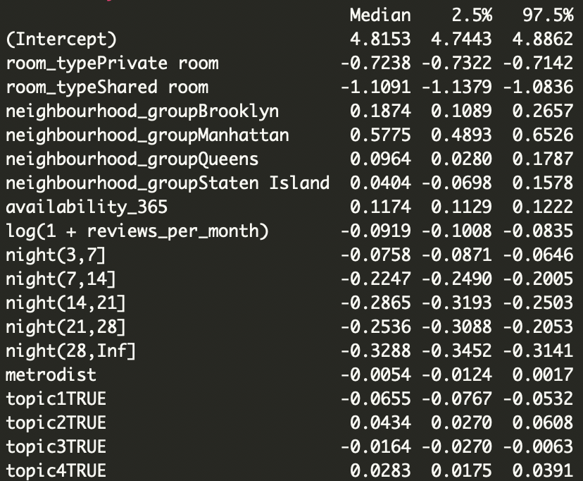
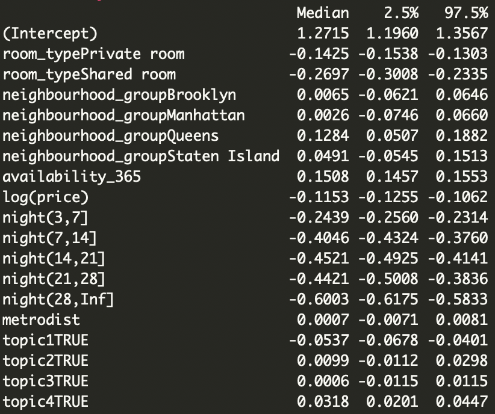
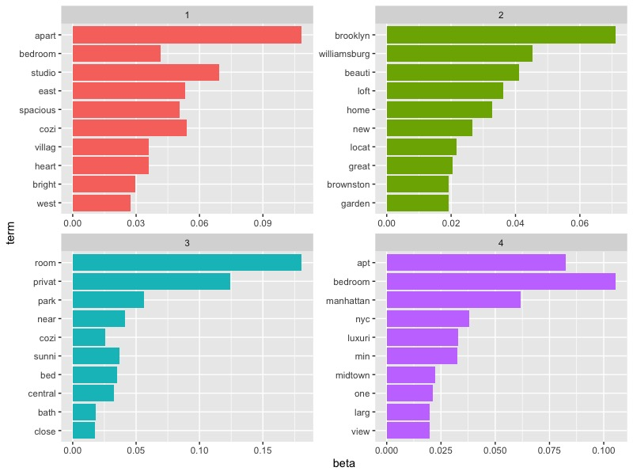

\fontsize{10}{11}
\selectfont

##### Abstract

Airbnb home rental listings vary in price and popularity; one question perninent to hosts is which listings are most successful. We explore the relationships between certain rental characteristics (including neighbourhood location) and listing price/popularity in NYC. 

#### 1. Introduction

Airbnb is a platform provides more personalized home rentals for travelers compared with hotels. Our data observations consist of 48,895 individual Airbnb listings in New York City. Each listing observation contains the following variables: host ID, neighbourhood group, neighbourhood, longitude/latitude, available days of the listing in a year, room type, price, minimum nights required, number of reviews, and reviews per month.

From the perspective of a host, we are interested in exploring the patterns in price and popularity. Specifically, we are interested in (1) quantifying the influential factors in the price/popularity and evaluating their influence (2) exploring the most valuable neighborhoods with adjusting the influential factors (3) choose a location and set a price for the listing (4) name the listing. 

(Most questions of interest we address in this case study involve finding patterns in price and popularity among neighbourhoods. We find the most influential factors in the price/popularity of a listing, and look for heterogeneity among neighbourhoods and boroughs in terms of traffic, price, and room type. From this and some text analysis, we build an Airbnb listing which would be predicted to be among the most profitable in NYC.)

#### 2. Materials and Methods

##### 2.1 Exploratory Data Analysis


##### 2.2 Data Preprocessing and Missing data manipulation

The availability_365 variable has zero-valued observations which may correspond to hosts who temporarily take their listings off the market. Comparing the distribution of other variables for zero-valued vs. positive-valued availability_365 observations suggests that the data may be missing at random because we don't see an obvious pattern in missingness. Using MICE [@buuren2010mice], we impute the data, treating the zero-valued observations as missing values. 

Our model using the imputed data had indistinguishable AIC with our model without imputed data. As a result, we choose to use the original dataset and in future work, explore missingness of availability_365 further.  

##### 2.3 Main Model

Since the price and popularity are strongly related to the location of listings and neighboods provides a natural boundary for spatial characteristics of listings, we consider a multilevel conditional autoregressive Bayesian model (CARBayes)[@lee2013carbayes] based on neighbood units as follows:
$$ \begin{aligned}
 	Y_{kj}|\mu_{kj} \sim f(y_{kj}|\mu_{kj}, \nu^2), \ \ \ &k= \text{neighbourhood}
=1,...,K\\
  &j=\text{listings}=1,...,m_k \end{aligned}$$
$$g(\mu_{kj})=x_{kj}^T\beta + \psi_{kj}$$
$$\psi_{kj}=\phi_k + \zeta_{kj}$$,
where $\beta$ represents the potential effect of predictor $x_{kj}$, with a prior $\beta \sim N(\mu_\beta, \Sigma_\beta)$. $\phi_k$ and $\zeta_{kj}$ represents the neighbourhoods' effect and individual effect. We consider a autoregressive prior for $\phi_k$:
$$\phi_k|\phi_{-k} \sim N\Big(\frac{\rho \sum_{l=1}^K w_{kl}\phi_j}{\rho \sum_{j=1}^K w_{kl}+1-\rho}, \frac{\tau^2}{\rho\sum_{j=1}^Kw_{kl}+1-\rho}\Big)$$
where $w_{kl}$ is known from data with $w_{kl}=1$ denotes neighbourhood $k$ is adjacent to neighbourhood $l$, and $0$ otherwise; $\rho\sim U(0,1)$ capture the relation between neighbourhood effects. This prior captures the spatial structure among neighbourhoods for each neighborhoods' effect is centered at the weighted sum of the effects from its neighbors.

We consider `log(price)` and `log(1+review_per_month)`(popularity) as response variable and model them separately. We include room type, price, minimum nights required, price/popularity as predictors. Additionally, we incorporate the logarithm distance from a listing to the nearest metro station (from extra data source) and extracted features from LDA model as predictors. To obtain the adjacency matrix for neighbourhoods, we incorporate shape file from NYC Opendata and re-allocate listings to new neighbourhoods.

To carry out text analysis on names of listings, we consider using text mining methods including Porter's stemmer algorithm [@porter2001snowball], wordcloud, Latent Dirichlet Allocation [@blei2003latent], etc. We first preprocess these names by transforming them to lower case and removing non-informative characters (e.g. punctuations, stopwords, whitespace, numbers). Then we use Porter's stemmer algorithm for word normalization, which allows us to extract all the common roots of informative words. Based on the result, we further execute word frequency analysis for different boroughs, and use wordcloud to display frequent words. Moreover, we implement LDA to build up a Bayesian generative model, assigning each word a weight of related topics (e.g. adjectives, locations). Features obtained from LDA will be included in our multilevel CAR regression model. 

#### 3. Results

##### 3.1 Exploratory Data Analysis

We obtain an intuitive understanding of the data based on plots of price, popularity and traffic (Figs \ref{} ). Most high-priced listings are located in Manhattan, while some of them also lie in Brooklyn. Similar pattern is discovered for traffic. In addition, EDA plots for room type (Fig \ref{}) demonstrate that it matters for price but not for popularity. We can also see the heterogeneity of room type across boroughs/neighborhoods. Wordcloud (Fig \ref{}) implies some high-frequency words in high-priced listings: luxury, manhattan, apartment, etc. 


##### 3.2 Main Results

According to model coefficient estimation (Fig \ref{fig:car1-sum}), our multilevel CAR model on price demonstrates the following patterns. Numbers in brackets are median of corresponding coefficients. For room type, entire room (0) is more expensive than private ones (-0.7) and shared ones (-1.1), with shared room being the cheapest. Manhattan (0.57) stands out to be the most luxurious borough, and Bronx (0) has the lowest price. Availability (0.12) is positively related to price while reviews per month (-0.0) is negatively related. In addition, more strict requirement on minimum nights results in lower price, which aligns with our common sense. And longer distance to metro stations also reduces the price (-0.005). Table \ref{table:1} shows the WAIC of different models, which allow us to choose the most influential factor for price(room type).

Model on popularity (\ref{fig:car1-sum}) has some similarity but is different as follows. Compared to other four boroughs, Queens borough (0.13) has the highest average reviews. Availability still has a positive effect (0.15) while price (-0.12) leads to a negative influence. Moreover, metro distance is no longer significant for predicting popularity. Table \ref{table:2} shows the WAIC of different models, which allow us to choose the most influential factor for popularity (availability \& night).

Heterogeneity across neighbourhoods is shown in Fig \ref{fig:car1-plot} and \ref{fig:car2-plot}. According to Fig \ref{fig:car1-plot}, most neighbourhoods in Manhattan have higher average price, and their confidence interval is also narrower than others. Among all neighbourhoods, "Midtown South" in Manhattan turns out to be the most expensive one, while "New Drop-Midland Beach" in Staten Island becomes the one with lowest price. On the other hand, \ref{fig:car2-plot} indicates that "East Elmhurst" in Queen is the most popular neighbourhood, which makes sense since LaGuardia Airport is located here, and "Co-op City" is the most unpopular one. If we condsider top 20 neighbourhoods for price and popularity seperately, they have only one intersection at "Yorkville" in Manhattan.

Our text analysis (Fig \ref{fig:wordcloud1}, \ref{fig:wordcloud2}) indicates some critical words: luxury, manhattan, beautiful (Note that we use stemming algorithm so we get stem of words rather than words themselves). We further carry out LDA to find latent topics in listing names. We choose 4 topics which is not too complicated and has a reasonable result (Fig \ref{fig:LDA}). The 4 topics can be categorized as adjectives, locations, Brooklyn related and Manhattan related. If we further add these 4 topics into our model (4 indicators), we conclude that Brooklyn and Manhattan has a positive significant coefficient, while the other two is significantly negative. 


##### 3.3 Sensitivity Analysis

#### 4. Answers to Questions

#### 5. Discussion

#### Appendix


```{r, echo=F, include=F}

library(sf)
library(dplyr)
library(tidyr)
library(ggplot2)

load("resultdataset 1.rdata")
adj = st_touches(p, sparse=FALSE)
adj2 = matrix(as.numeric(adj), 195, 195)
adj[adj==TRUE]=1

#corrplot::corrplot(adj,method="color",type="full",tl.col="black",cl.pos = "n")

res_dat=res_dat[res_dat$price!=0,]
res_dat=dplyr::select(as.data.frame(res_dat), -geometry)%>%
  mutate(host_id=as.factor(host_id),night=minimum_nights)
res_dat$night=cut(res_dat$night,breaks = c(0,3, 7, 14, 21,28,Inf), right = TRUE)

res_dat = res_dat %>% mutate(ind_area = as.integer(res_dat$ntaname))


dat = res_dat
dat = dat[, !names(dat) %in% c('id', 'host_name','last_review')]
dat$reviews_per_month[is.na(dat$reviews_per_month)] = 0
dat = dat %>% filter(price > 0)
dat = dat %>% filter(!is.na(dat$ind_area))

dat$nata_droped = droplevels(dat$ntaname)
dat$ind_area = as.integer(dat$nata_droped)
which(levels(dat$ntaname) %in% setdiff(levels(dat$ntaname), dat$ntaname))
# 1, 72, 135, 149
adjj = adj2[-c(1,72,135,149), -c(1,72,135,149)]


dat$availability_365 = scale(dat$availability_365)


dat$minimum_nights = as.factor(dat$minimum_nights)


dat$topic1 = grepl("apart", dat$name) | grepl("bedroom", dat$name) | grepl("studio", dat$name) | grepl("east", dat$name) | grepl("spacious", dat$name) | grepl("cozi", dat$name) | grepl("villag", dat$name) | grepl("heart", dat$name) | grepl("bright", dat$name) | grepl("west", dat$name)

dat$topic2 = grepl("brooklyn", dat$name) | grepl("williamsburg", dat$name) | grepl("beauti", dat$name) | grepl("loft", dat$name) | grepl("home", dat$name) | grepl("new", dat$name) | grepl("locat", dat$name) | grepl("great", dat$name) | grepl("brownston", dat$name) | grepl("garden", dat$name) | grepl("west", dat$name)

dat$topic3 = grepl("room", dat$name) | grepl("privat", dat$name) | grepl("park", dat$name) | grepl("near", dat$name) | grepl("cozi", dat$name) | grepl("sunni", dat$name) | grepl("bed", dat$name) | grepl("central", dat$name) | grepl("bath", dat$name) | grepl("close", dat$name) 

dat$topic4 = grepl("apt", dat$name) | grepl("bedroom", dat$name) | grepl("manhattan", dat$name) | grepl("nyc", dat$name) | grepl("luxuri", dat$name) | grepl("min", dat$name) | grepl("midtown", dat$name) | grepl("one", dat$name) | grepl("large", dat$name) | grepl("view", dat$name) 


```


```{r Price CAR, echo=FALSE,out.width = '70%',  cache=TRUE, fig.align='center',fig.cap="\\label{fig:car1-sum} CAR Model on price - Model Summary"}

```


```{r Reviews CAR, echo=FALSE,out.width = '70%', cache=TRUE,fig.align='center', ,fig.cap="\\label{fig:car2-sum} CAR Model on popularity - Model Summary"}

```


```{r, echo=F, include=F}
library(CARBayes)
s =S.CARmultilevel(formula=log(price) ~  room_type  + availability_365 + log(1 + reviews_per_month) + night + metrodist + topic1 + topic2 + topic3 + topic4,
                family = 'gaussian', data = dat, ind.area=dat$ind_area,
                W=adjj, burnin=100, n.sample=200, thin = 3)

s2 = S.CARmultilevel(formula=log(1+reviews_per_month) ~  room_type  + availability_365 + log(price) + night + metrodist + topic1 + topic2 + topic3 + topic4,family = 'gaussian', data = dat, ind.area=dat$ind_area,W=adjj, burnin=100, n.sample=200, thin = 3)
ss = s$samples

phidf = as.data.frame(ss$phi)
colnames(phidf) = 1:191
phidf = phidf %>% gather()


Man = which(levels(dat$nata_droped) %in% unique(dat$nata_droped[dat$neighbourhood_group=="Manhattan"]))
Bky = which(levels(dat$nata_droped) %in% unique(dat$nata_droped[dat$neighbourhood_group=="Brooklyn"]))
Que = which(levels(dat$nata_droped) %in% unique(dat$nata_droped[dat$neighbourhood_group=="Queens"]))
SI = which(levels(dat$nata_droped) %in% unique(dat$nata_droped[dat$neighbourhood_group=="Staten Island"]))
Bnx = which(levels(dat$nata_droped) %in% unique(dat$nata_droped[dat$neighbourhood_group=="Bronx"]))

phidf$borough = rep('0', dim(phidf)[1])
phidf$borough[phidf$key %in% Man] = 'Manhattan'
phidf$borough[phidf$key %in% Que] = 'Queen'
phidf$borough[phidf$key %in% SI] = 'Staten Island'
phidf$borough[phidf$key %in% Bnx] = 'Bronx'
phidf$borough[phidf$key %in% Bky] = 'Brooklyn'
```

```{r Price CAR plot, echo=FALSE,cache=TRUE, fig.width = 8,fig.cap="\\label{fig:car1-plot} CAR Model on price - Neighbourhoods"}
library(ggplot2)
ggplot(phidf, aes(x = borough, y = value, fill = key))+
  geom_boxplot(show.legend = FALSE, lwd= 0.1, outlier.size=0.1)+
  theme(axis.text.x = element_text(hjust = 1, size=10))

```

```{r, echo=F, include=F}

ss = s2$samples

phidf = as.data.frame(ss$phi)
colnames(phidf) = 1:191
phidf = phidf %>% gather()


Man = which(levels(dat$nata_droped) %in% unique(dat$nata_droped[dat$neighbourhood_group=="Manhattan"]))
Bky = which(levels(dat$nata_droped) %in% unique(dat$nata_droped[dat$neighbourhood_group=="Brooklyn"]))
Que = which(levels(dat$nata_droped) %in% unique(dat$nata_droped[dat$neighbourhood_group=="Queens"]))
SI = which(levels(dat$nata_droped) %in% unique(dat$nata_droped[dat$neighbourhood_group=="Staten Island"]))
Bnx = which(levels(dat$nata_droped) %in% unique(dat$nata_droped[dat$neighbourhood_group=="Bronx"]))

phidf$borough = rep('0', dim(phidf)[1])
phidf$borough[phidf$key %in% Man] = 'Manhattan'
phidf$borough[phidf$key %in% Que] = 'Queen'
phidf$borough[phidf$key %in% SI] = 'Staten Island'
phidf$borough[phidf$key %in% Bnx] = 'Bronx'
phidf$borough[phidf$key %in% Bky] = 'Brooklyn'
```

```{r Pop CAR plot, echo=FALSE,cache=TRUE, fig.width = 8,fig.cap="\\label{fig:car2-plot} CAR Model on popularity - Neighbourhoods"}
library(ggplot2)
ggplot(phidf, aes(x = borough, y = value, fill = key))+
  geom_boxplot(show.legend = FALSE, lwd= 0.1, outlier.size=0.1)+
  theme(axis.text.x = element_text(hjust = 1, size=10))

```


\begin{table}[]
\centering
\begin{tabular}{|l|l|l|l|l|l|l|l|}
\hline
Model & All var & Room type & Availability & Reviews & Night & neighborhood   \\ \hline
WAIC  & 63998   & 85372     & 66426        & 64501   & 66023 & 70860          \\ \hline
\end{tabular}
\caption{WAIC for model on price: without 1 variable}
\label{table:1}
\end{table}


\begin{table}[]
\centering
\begin{tabular}{|l|l|l|l|l|l|l|l|}
\hline
Model & All var & Room type & Availability & Price & Night & neighborhood   \\ \hline
WAIC  & 74803   & 75370     & 78011        & 75297   & 80749 & 75881          \\ \hline
\end{tabular}
\caption{WAIC for model on popularity: without 1 variable}
\label{table:2}
\end{table}


```{r Wordcloud1, echo=FALSE,cache=TRUE, fig.width = 4,fig.cap="\\label{fig:wordcloud1} Wordcloud for listings with price > 2000", warning=FALSE}
Names = data.frame(name = dat$name[dat$price>1000])
library(tm)
text_corpus <- VCorpus(VectorSource(Names$name))

text_corpus_clean <- tm_map(text_corpus, content_transformer(tolower))
text_corpus_clean <- tm_map(text_corpus_clean, stemDocument)
text_corpus_clean <- tm_map(text_corpus_clean, removeNumbers)
text_corpus_clean <- tm_map(text_corpus_clean, removeWords, stopwords())
text_corpus_clean <- tm_map(text_corpus_clean, removePunctuation)
text_corpus_clean <- tm_map(text_corpus_clean, stripWhitespace)

library(wordcloud)
wordcloud(text_corpus_clean, min.freq = 5, random.order = FALSE,
          colors=brewer.pal(8, "Dark2"))
```


```{r Wordcloud2, echo=FALSE,cache=TRUE, fig.width = 4,fig.cap="\\label{fig:wordcloud2} Wordcloud for listings", warning=FALSE}
Names = data.frame(name = dat$name)
library(tm)
text_corpus <- VCorpus(VectorSource(Names$name))

text_corpus_clean <- tm_map(text_corpus, content_transformer(tolower))
text_corpus_clean <- tm_map(text_corpus_clean, stemDocument)
text_corpus_clean <- tm_map(text_corpus_clean, removeNumbers)
text_corpus_clean <- tm_map(text_corpus_clean, removeWords, stopwords())
text_corpus_clean <- tm_map(text_corpus_clean, removePunctuation)
text_corpus_clean <- tm_map(text_corpus_clean, stripWhitespace)

library(wordcloud)
wordcloud(text_corpus_clean, min.freq = 10, random.order = FALSE,
          colors=brewer.pal(8, "Dark2"))
```

```{r LDA, eval = FALSE, echo=FALSE,cache=TRUE, , warning=FALSE}
text_dtm <- DocumentTermMatrix(text_corpus_clean)
text_dtm

library(topicmodels)

rowTotals <- apply(text_dtm , 1, sum) #Find the sum of words in each Document
dtm.new   <- text_dtm[rowTotals> 0, ] 

text_lda <- LDA(dtm.new, k = 4, method = "VEM", control = NULL)
library(tidytext)
text_topics <- tidy(text_lda, matrix = "beta")
text_topics

library(ggplot2)
text_top_terms <- text_topics %>%
  group_by(topic) %>%
  top_n(10, beta) %>%
  ungroup() %>%
  arrange(topic, -beta)

text_top_terms %>%
  mutate(term = reorder(term, beta)) %>%
  ggplot(aes(term, beta, fill = factor(topic))) +
  geom_col(show.legend = FALSE) +
  facet_wrap(~ topic, scales = "free") +
  coord_flip()

```

```{r pressure, echo=FALSE, fig.cap="\\label{fig:LDA} LDA: Top 10 words in each topic", out.width = '100%'}

```

